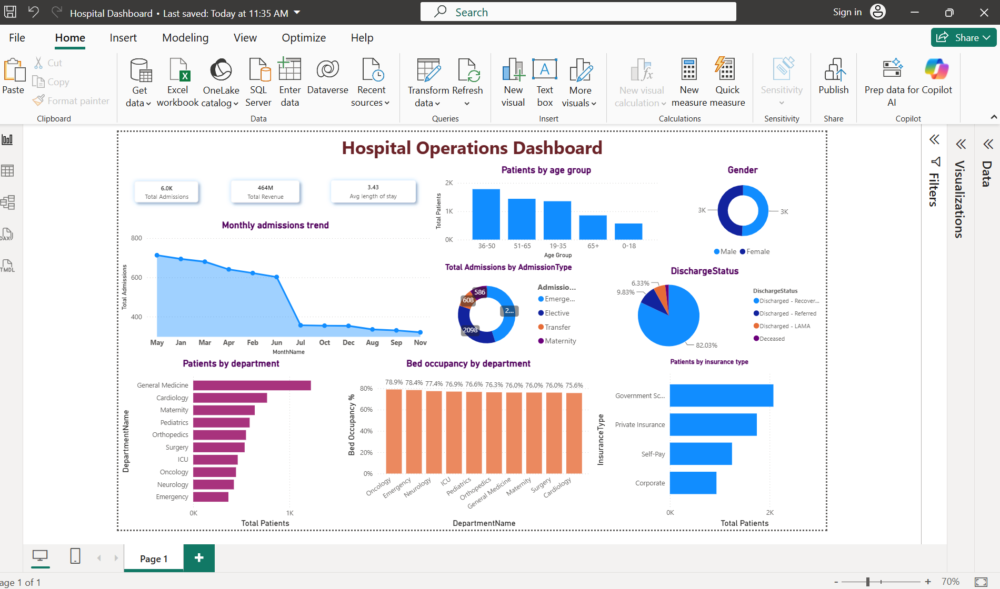

# 🏥 Healthcare Operations Dashboard using Power BI

## 📌 Project Overview

This project is an interactive Healthcare Operations Dashboard developed using Microsoft Power BI. It helps analyze hospital operations by visualizing patient admissions, revenue, department performance, bed occupancy, discharge status, and patient demographics.

---

## 🎯 Project Objectives

- Monitor hospital admissions
- Analyze patient demographics
- Track hospital revenue
- Monitor bed occupancy
- Analyze discharge status
- Support data-driven decision-making

---

## 🛠 Tools Used

- Microsoft Power BI Desktop
- Microsoft Excel
- DAX (Data Analysis Expressions)

---

## 📂 Dataset

Hospital Operations Sample Dataset

Tables Used:
- Fact_Admissions
- Fact_BedOccupancy
- Dim_Department
- Dim_Doctor
- Dim_Date

---

## 📊 Dashboard Features

### KPI Cards
- Total Admissions
- Total Revenue
- Average Length of Stay (LOS)

### Charts
- Monthly Admission Trend
- Patients by Age Group
- Gender Distribution
- Admission Type
- Patients by Insurance Type
- Patients by Department
- Total Patients by Department
- Bed Occupancy by Department
- Discharge Status

---

## 📈 Key Insights

- Admission trends can be monitored monthly.
- Bed occupancy helps optimize hospital resources.
- Revenue can be analyzed by department.
- Patient demographics provide insights into age and gender distribution.
- Discharge status helps monitor treatment outcomes.

---

## 📷 Dashboard Preview

*(Replace the line below with your uploaded dashboard image once it is in the repository.)*

---

## 🚀 Future Enhancements

- Doctor Performance Dashboard
- Patient Satisfaction Dashboard
- Readmission Analysis
- Predictive Analytics using Machine Learning

---

## 👨‍💻 Author

**Pavan Kuntala**

GitHub: https://github.com/kuntalapavan29
